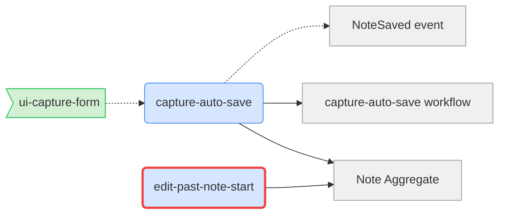

ユーザが `/ori-graph` を呼んだ際、**ori の coherence graph を Mermaid 図として出力**します。ノード = domain section + feature、エッジ = `derives_from` / `references`。**dirty ノードを視覚的に強調**して伝播状態を一目で見せます。

## 役割

- **可視化エンジン**：CLI から graph データを取得し Mermaid に変換
- **状態強調**：dirty / clean / orphan を色分け
- **出力先選択**：stdout（プレビュー）または `.ori/graph.mmd`（commit 対象）

## 入力 / 出力

- 入力：プロジェクト全体（domain + features + manifests）
- 出力：
  - 標準出力に Mermaid 形式（GitHub PR / docs サイトで render 可能）
  - `--save` オプション時：`.ori/graph.mmd` にファイル保存（git tracked）

## ノード種別

| ノード種 | Mermaid 記号 | 色 |
|---------|------------|----|
| domain section | `[Note Aggregate]` | グレー |
| workflow feature | `(capture-auto-save)` | 青 |
| UI feature | `>ui-capture-form]` | 緑 |
| dirty node | 上記 + `:::dirty` class | 赤枠 |
| orphan node | 上記 + `:::orphan` class | 黄破線 |

## エッジ種別

| エッジ | Mermaid 記号 |
|--------|------------|
| derives_from | `-->` |
| references | `-.->` |
| upstream/downstream (context-map) | `==>` |

## 手順

1. **CLI からデータ取得**：
   ```bash
   ori graph --format=json
   ```
   返り値：
   ```json
   {
     "nodes": [
       { "id": "domain/aggregates.md#note-aggregate", "type": "domain-section", "dirty": false },
       { "id": "features/capture-auto-save", "type": "workflow-feature", "dirty": true }
     ],
     "edges": [
       { "from": "features/capture-auto-save", "to": "domain/aggregates.md#note-aggregate", "type": "derives_from" }
     ]
   }
   ```
2. **Mermaid に変換**（テンプレート展開）
3. **オプション処理**：
   - `--save` → `.ori/graph.mmd` に書き出す
   - `--focus <feature-id>` → 当該 feature と直接接続のみ表示
   - `--depth N` → focus 時の隣接深さ
4. **出力**：stdout に Mermaid（save 時はパスも報告）

## 出力テンプレート



## オプション

| flag | 効果 |
|------|------|
| `--save` | `.ori/graph.mmd` に保存（commit 対象） |
| `--focus <id>` | 当該 node の周辺のみ |
| `--depth <N>` | focus 時の探索深さ（default 2） |
| `--no-ui` | UI feature を除外（DDD レビュー用） |
| `--only-dirty` | dirty に関わる subgraph のみ |

## 注意

- **Mermaid サイズ上限に注意**：50+ ノードで読みにくくなる。`--focus` 推奨
- **`.ori/graph.mmd` を作るなら commit すべきか**：機械生成なので gitignore も選択肢
  - **推奨**：commit する。docs サイトで render するため
- **read-only**：このスキル自体は副作用なし（`--save` 時のみファイル生成）
- **CI 統合**：将来 `ori graph --format=svg` で PR に貼る想定

## 次のアクション

graph 出力後、ユーザに以下を提示：

- **dirty ノードがある場合**：影響の大きい順に `/ori-flow <id>` で再 derive
- **orphan が見つかった場合**：`/ori-doctor` で詳細診断 → 該当 domain section の削除可否を判断
- **設計レビューに使うパス**：PR description に Mermaid を貼り、レビュアーと議論
- **保存パス**：`/ori-graph --save` で `.ori/graph.mmd` を commit し docs サイトで render
- **focus パス**：複雑な場合 `/ori-graph --focus <id>` で当該 feature 周辺のみに絞る
