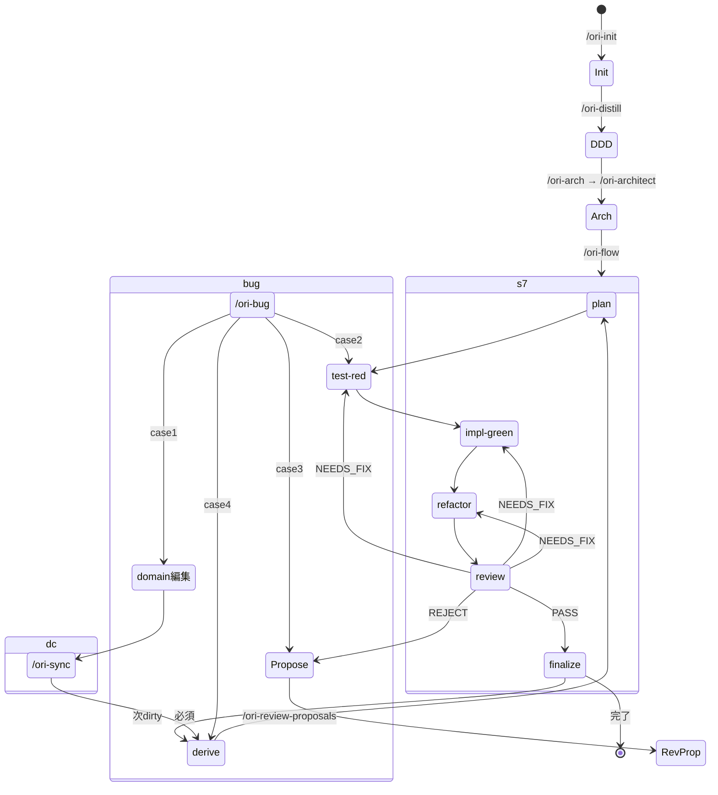

# Agent Instructions

**言語ポリシー**: 思考は英語でよいが、応答は日本語で行うこと。PR の title / description も日本語で書くこと（コード内の専門用語は英語のまま混在 OK）。

This file provides instructions and context for AI coding agents working on this project.

This project uses **bd** (beads) for issue tracking. Run `bd prime` for full workflow context.

## Quick Reference

```bash
bd ready              # Find available work
bd show <id>          # View issue details
bd update <id> --claim  # Claim work atomically
bd close <id>         # Complete work
bd dolt push          # Push beads data to remote
```

## Non-Interactive Shell Commands

**ALWAYS use non-interactive flags** with file operations to avoid hanging on confirmation prompts.

Shell commands like `cp`, `mv`, and `rm` may be aliased to include `-i` (interactive) mode on some systems, causing the agent to hang indefinitely waiting for y/n input.

**Use these forms instead:**
```bash
# Force overwrite without prompting
cp -f source dest           # NOT: cp source dest
mv -f source dest           # NOT: mv source dest
rm -f file                  # NOT: rm file

# For recursive operations
rm -rf directory            # NOT: rm -r directory
cp -rf source dest          # NOT: cp -r source dest
```

**Other commands that may prompt:**
- `scp` - use `-o BatchMode=yes` for non-interactive
- `ssh` - use `-o BatchMode=yes` to fail instead of prompting
- `apt-get` - use `-y` flag
- `brew` - use `HOMEBREW_NO_AUTO_UPDATE=1` env var

<!-- BEGIN BEADS INTEGRATION v:1 profile:minimal hash:ca08a54f -->
## Beads Issue Tracker

This project uses **bd** (beads) for issue tracking. Run `bd prime` to see full workflow context and commands.

### Quick Reference

```bash
bd ready              # Find available work
bd show <id>          # View issue details
bd update <id> --claim  # Claim work
bd close <id>         # Complete work
```

### Rules

- Use `bd` for ALL task tracking — do NOT use TodoWrite, TaskCreate, or markdown TODO lists
- Run `bd prime` for detailed command reference and session close protocol
- Use `bd remember` for persistent knowledge — do NOT use MEMORY.md files

## Session Completion

**When ending a work session**, you MUST complete ALL steps below. Work is NOT complete until `git push` succeeds.

**MANDATORY WORKFLOW:**

1. **File issues for remaining work** - Create issues for anything that needs follow-up
2. **Run quality gates** (if code changed) - Tests, linters, builds
3. **Update issue status** - Close finished work, update in-progress items
4. **PUSH TO REMOTE** - This is MANDATORY:
   ```bash
   git pull --rebase
   bd dolt push
   git push
   git status  # MUST show "up to date with origin"
   ```
5. **Clean up** - Clear stashes, prune remote branches
6. **Verify** - All changes committed AND pushed
7. **Hand off** - Provide context for next session

**CRITICAL RULES:**
- Work is NOT complete until `git push` succeeds
- NEVER stop before pushing - that leaves work stranded locally
- NEVER say "ready to push when you are" - YOU must push
- If push fails, resolve and retry until it succeeds
<!-- END BEADS INTEGRATION -->


## Task Management (project-specific override)

bd plugin の default rule (`do NOT use TodoWrite`) を **緩和** し、tier 階層で使い分ける。
根拠: decision `ori-9fg` / memory key `task-management-rule` (`bd recall task-management-rule`)。

### Tier 構造

```
beads epic / parent issue   (= 1 PR、bundling 単位)
  ↓
  beads child issue          (= 永続 sub-deliverable、ship 可能単位)
    ↓
    TodoWrite items          (= 1 session 内 impl step、file 編集レベル)
```

### Epic 化 trigger

- **Target project** (= ori 利用者リポジトリ): `/ori-flow` 起動なら即 epic、それ以外は default issue
- **Meta project** (= ori 本体、このリポジトリ): 推定変更 file 数 ≥ 5 OR 推定変更 package ≥ 2 なら epic、それ以外は default issue
- **共通**: session 跨ぎ発生時は epic 化を提案 (lazy promote safety net)

### Lazy promote mechanics (γ rule)

`bd update --type` flag は無いので、**既存 issue ID を維持** したまま parent-child で「暗黙 epic」を表現:

```bash
bd create --parent=ori-XXX --title="残 sub-task A" -t task
bd create --parent=ori-XXX --title="残 sub-task B" -t task
```

`ori-XXX` 自体は type=task のまま。新 epic ID で wrap する β rule は ID 不連続 = 指示簡潔化要件と衝突するため、user 明示要請時のみ。

**制約 (verified 2026-06-11)**: `bd epic status` / `bd epic close-eligible` は **type=epic のみ filter** するため、暗黙 epic はこれらに現れない。epic 構造の確認は `bd dep tree ori-XXX` / `bd show ori-XXX` を使い、close は `bd close ori-XXX` で manual に行う。既存 Phase J (ori-c4w) / Phase K (ori-6kd) も同様の運用で機能していた。

### Dispatch rule (instruct: 「ori-XXX に取り組んで」)

User は epic/issue の区別を意識せず ID のみ指定。Claude が `bd show` で状態判定して Mode 自動選択:

| 状態 | Mode | 振る舞い |
|---|---|---|
| has children (parent-child あり) | Mode-Epic | `bd ready` で child を依存解決順に取り組む、各 child は最小 ship 単位として Mode-Flat 再帰 |
| no children + in_progress + notes 履歴あり | Mode-Resume | notes 読込で進捗復元、TodoWrite reconstruct して続行 |
| no children + fresh / open | Mode-Flat | 直接実装、起動時 volume 判定 → 必要なら epic 化提案 |
| closed | — | "閉じています、新規 issue を作りますか?" 確認 |
| blocked | — | blocker 表示して停止 |

### Roadmap phase は label

Phase A〜K は `--labels=phase-x` で表現、epic 化しない (forever-open epic を避ける)。既存 `phase-b` 等の label 運用と整合。

### Session 終了時の進捗保存

- Mode-Flat / Resume で **TodoWrite に残作業が残る場合**: 該当 beads issue の notes に進捗を append (`bd update ori-XXX --append-notes="session N: ..."`)、次 session で Mode-Resume が復元
- 残作業が異質な複数 deliverable に分かれる場合: lazy promote (γ) で child 化


## Build & Test

_Add your build and test commands here_

```bash
# Example:
# npm install
# npm test
```

## ori ハーネス状態遷移

### 全体像

```
/ori-init → /ori-distill → /ori-arch → /ori-architect → /ori-flow <id> × N → /ori-sync
                                                                                    ↓
                                    ┌─── ドメイン変更時はここに戻る ←──────────────┘
                                    ↓
                              /ori-sync (dirty検出) → /ori-flow × N (7 phase) → /ori-finalize
```

### 7 phase flow（/ori-flow 内部）

| # | phase | コマンド | 判定 | 差し戻し先 |
|---|-------|---------|------|-----------|
| 1 | derive | `/ori-derive <id>` | spec.md 合成完了 → 次へ | — |
| 2 | plan | `/ori-plan <id>` | beads issues scaffold → 次へ | — |
| 3 | test-red | `/ori-test-red <id>` | RED テスト着地 → 次へ | impl-green（GREEN-on-first 検出時） |
| 4 | impl-green | `/ori-impl-green <id>` | 全 test GREEN → 次へ | test-red（self-fix 1回失敗時） |
| 5 | refactor | `/ori-refactor <id>` | 品質改善 → 次へ | impl-green（regression 発生時） |
| 6 | review | `/ori-review <id>` | 3 gate + reviewer → PASS/NEEDS_FIX/REJECT | test-red / impl-green / refactor / propose |
| 7 | finalize | `/ori-finalize <id>` | verdict=PASS → dirty 解除 | — |

### ガード（バイパス防止）

| 層 | メカニズム | 違反時の動作 |
|----|-----------|------------|
| L1 | `/ori-sync` の出力で `/ori-flow` を「必須」と明示 | 提案ではなく強制。spec 直接編集禁止を宣言 |
| L2 | `clear-dirty.sh` が `review.md` の verdict=PASS を確認 | 不在 or ≠PASS → 拒否 (exit 1) |
| L3 | `/ori-doctor` `check-dirty-integrity.sh` が dirty=[] + review 未完了を検出 | 事後バレ。git diff で証跡残る |

**アンチパターン（厳禁）**:
- `sed -i 's/^dirty:.*/dirty: []/' status.yaml` 直打ち → L3 で検出
- spec.md を `/ori-sync --force` で編集 → `--force` は廃止済
- review skip → L2 で拒否

### ドメイン変更伝播

```
domain/ 編集 → /ori-sync (dirtyマーク伝播)
                 ↓
            全 dirty slice に対して /ori-flow が必須
                 ↓
            /ori-finalize (review PASS → dirty解除)
```

**ルール**: dirty の手動解除は不可。`/ori-finalize` の `clear-dirty.sh` が review gate を通過した場合のみ解除される。

### バグリカバリー

```
/ori-bug → triage 4分類:
  case 1 (domain)     → domain/ 編集 → /ori-sync → /ori-flow
  case 2 (impl)       → test追加 → /ori-impl-green → /ori-review
  case 3 (spec)       → /ori-propose → /ori-review-proposals
  case 4 (cross-slice)→ /ori-distill → 新slice → /ori-flow
```

### 診断コマンド

| コマンド | 用途 |
|---------|------|
| `/ori-doctor` | 全診断（dirty integrity 含む）。report only、自動修復しない |
| `/ori-feature-status` | slice/page 進捗俯瞰 |
| `/ori-graph` | 依存グラフ可視化 |

### Mermaid



## Architecture Overview

_Add a brief overview of your project architecture_

## Conventions & Patterns

_Add your project-specific conventions here_