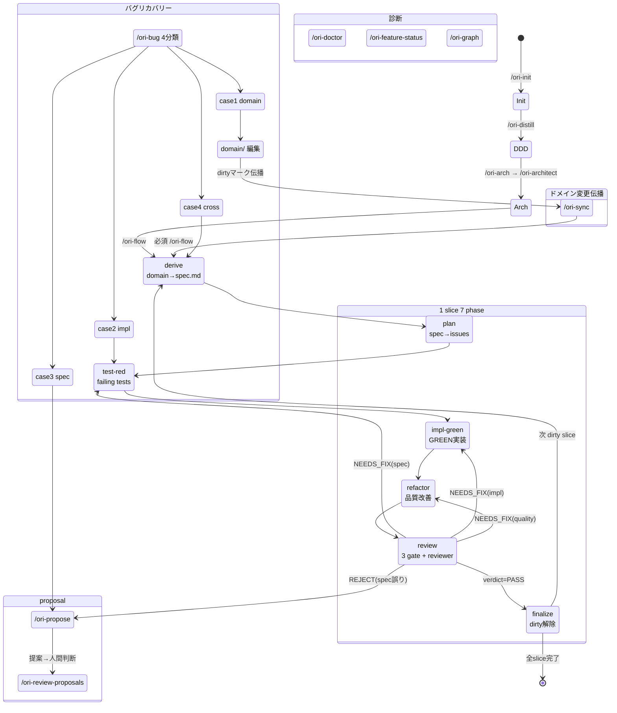

# ori（織）

> DDD ドキュメントを Single Source of Truth として、slice ごとに軽量 TDD + CoDD 流の変更伝播を回す開発フレームワーク。

[](LICENSE)

## 概要

**ori** は以下を統合した開発支援ツールです：

- **DDD ドキュメント生成**（[distill-ddd](https://github.com/tango238/distill-ddd) ベース）
- **slice 単位の軽量 TDD ワークフロー**（VCSDD を軽量化、[cc-sdd](https://github.com/gotalab/cc-sdd) を参考）
- **CoDD 流の変更伝播**（ドメイン文書 ↔ slice / page ↔ コードを単一グラフで管理）
- **multi-CLI 配布**（[APM](https://github.com/microsoft/apm) 経由で Claude Code / Codex / OpenCode / Cursor / Copilot / Gemini / Windsurf 対応）

## 状態遷移

ori ハーネスの全 skill と状態遷移を俯瞰します。

### メインフロー

#### 1. プロジェクト立ち上げ

| Step | コマンド | 状態変化 |
|------|---------|---------|
| 初期化 | `/ori-init` | `.ori/` skeleton 生成 |
| DDD フェーズ 1-11 | `/ori-distill` | `.ori/domain/{discovery,aggregates,...}` 生成 |
| Architecture 決定 | `/ori-arch` → `/ori-architect` | `.ori/architecture.md` を要件対話から生成 |
| 初回実装 | `/ori-flow <id>` | slice を 7 phase で完走 |

#### 2. 1 slice 実装（7 phase）

`/ori-flow <id>` の内部遷移。各 phase を手動で個別実行しても完全等価。

| Phase | コマンド | 入力 → 出力 | beads issue |
|-------|---------|------------|-------------|
| 1. derive | `/ori-derive` | domain → `spec.md` | `ori-derive-<id>` |
| 2. plan | `/ori-plan` | `spec.md` → beads issues | `ori-plan-<id>` |
| 3. test-red | `/ori-test-red` | spec → failing tests | `ori-test-red-<id>` |
| 4. impl-green | `/ori-impl-green` | tests → GREEN 実装 | `ori-impl-green-<id>` |
| 5. refactor | `/ori-refactor` | 実装 → 品質改善 | `ori-refactor-<id>` |
| 6. review | `/ori-review` | spec/impl → review.md | `ori-review-<id>` |
| 7. finalize | `/ori-finalize` | review PASS → dirty 解除 | `ori-finalize-<id>` |

**ガード**: `clear-dirty.sh` は `review.md` の verdict=PASS がないと dirty 解除を拒否する。`sed` 直打ちによる手動解除は `/ori-doctor` の `check-dirty-integrity.sh` が検出する。

#### 3. ドメイン変更の伝播

| Step | コマンド | 状態変化 |
|------|---------|---------|
| ドメイン編集 | `vim .ori/domain/aggregates.md` | 不変条件追加/変更 |
| 変更検知 | `/ori-sync` | 影響 slice を dirty マーク。`/ori-flow` が必須 |
| 伝播実装 | `/ori-flow <dirty-slice>` × N | 各 dirty slice を 7 phase |
| 締め | `/ori-finalize <id>` | review PASS 確認 → dirty 解除 |

**禁止**: spec 直接編集（SSoT 違反）、`status.yaml` 手動編集（review gate が拒否）。

#### 4. バグ発見時のリカバリー

| Step | コマンド | 振る舞い |
|------|---------|---------|
| triage | `/ori-bug` | 4 ケースに分類（domain / impl / spec / cross-slice） |
| ケース 1 (domain) | `vim .ori/domain/` → `/ori-sync` → `/ori-flow` | ドメイン修正 → 伝播 |
| ケース 2 (impl) | test 追加 → `/ori-impl-green` → `/ori-review` | 失敗テスト → 実装修正 |
| ケース 3 (spec) | `/ori-propose` → `/ori-review-proposals` | upstream 修正提案 → 人間判断 |
| ケース 4 (cross-slice) | `/ori-distill phase=workflows` → 新 slice → `/ori-flow` | シナリオ追加 → 統合 slice 作成 |

#### 5. 健康診断と全体俯瞰

| コマンド | 診断内容 |
|---------|---------|
| `/ori-doctor` | schema 健全性、hash 一致、dirty integrity、beads 同期、cross-reference、proposal 残存、orphan slice、DoD sweep、architecture guardrails (g-1..g-8) |
| `/ori-feature-status` | slice/page の進捗・dirty/blocked/done 一覧 |
| `/ori-graph` | Mermaid による依存グラフ可視化（dirty ノード強調） |

#### 6. 防御線（バイパス防止）

| 層 | どこ | 何を防ぐか |
|----|------|----------|
| L1 | `/ori-sync` | 「提案」ではなく「必須」。「spec.md 直接編集は SSoT 違反」を明示 |
| L2 | `clear-dirty.sh` | `review.md` 不在 or verdict≠PASS なら dirty 解除を拒否 |
| L3 | `/ori-doctor` | `status.yaml` 手動改竄（dirty=[] なのに review 未完了）を事後検出 |

### Mermaid 状態遷移図



## ori は *oriented* なハーネスです

ori は「AI に任意のコードを書かせるための薄いハーネス」ではありません。**「DDD ドキュメント → slice / page + DDD のコード骨格」というアーキテクチャまで指定する、opinionated（oriented）なハーネス**です。

- `/ori-arch` → `/ori-architect` が要件対話で pattern (`ddd-vsa-hex`) と stack (`typescript` / `typescript-tauri`) を確定し、slice ごとに `domain / application / infrastructure / presentation / tests` を切り、`index.ts` を唯一の public API として slice 間の直接 import を禁ずる雛形を吐きます
- `.ori/architecture.md` を SSoT として、arch-adapter が ESLint / Rust 等の言語ネイティブ linter にコンパイルされ、規約逸脱を CI で止めます
- AI に与えるのは「任意のスタイルで書く自由」ではなく「決められたスロットを埋める自由」です

## Getting started

スタック別の開始ガイドは [docs/start/index.md](docs/start/index.md) にまとまっています。代表例:

- [docs/start/typescript-web.md](docs/start/typescript-web.md) — TS 単体（web / Node）
- [docs/start/tauri-v2.md](docs/start/tauri-v2.md) — TS + Rust (Tauri 2)

共通ステップ:

```bash
# 1. インストール（ターゲットディレクトリで）
apm install dev-komenzar/ori

# 2. プロジェクトを scaffold
$ claude/opencode/...                          # Launch your agent
$ /ori-init                                    # .ori/ skeleton + config.yaml (silent)
$ /ori-distill                                 # AI が distill-ddd phase 1-11 を対話実行
$ /ori-arch                                    # /ori-architect に委譲し要件対話から architecture.md を生成
$ /ori-flow app-startup                        # 1 slice を 7 phase で実装
$ /ori-sync                                    # 変更伝播計算
```

## 設計原則

1. **DDD ドキュメントが Single Source of Truth** — 派生物 (spec / コード) の直接編集は guardrail が止める
2. **変更伝播は単一アルゴリズム** — `--force` で SSoT 保護を解除し、proposal で上流に戻す
3. **CLI = 決定的重処理 / AI = 創造的判断** — vendor lock-in 回避のため APM で multi-CLI 配布、capability-role でモデル抽象化

詳細は [docs/design.md](docs/design.md) を参照。

## ドキュメント

- **利用ガイド**
  - [スタック別 Getting started](docs/start/index.md)
  - [バグが見つかったときの動線](docs/guide/bug-triage.md) — slice 完走後にバグ発覚した際の triage と再走手順
- **コントリビューション**
  - [Contributing 入口](docs/contributing/index.md) — テンプレート募集 / PR ルール / リポジトリ構造
- **設計**
  - [docs/design.md](docs/design.md)

## 状態

**v0.4.0 — greenfield 利用可能**

新規プロジェクトを 0 から立ち上げる動線 (`/ori-init` → `/ori-distill` → `/ori-arch` → `/ori-flow`) は通しで動作します。MVP として `ddd-vsa-hex` パターン + TypeScript / TypeScript-Tauri スタックを sweet spot にサポートしています。

未対応：ブラウンフィールド (既存コードベースへの後付け導入) は `/ori-migrate-domain` を含む v0.5+ のロードマップです。

## ロードマップ

- **v0.3** — CLI 廃止 → skill + scripts ベース実行モデルに全面移行（完了）
- **v0.4** — Slice DoD enforcement chain、DDD 文書 frontmatter 統一（完了）
- **v0.5 以降** — ブラウンフィールド対応 (`/ori-migrate-domain`)、追加 template / arch adapter

詳細は [docs/design.md §19](docs/design.md#19-ロードマップ) を参照。issue tracker は [beads](https://github.com/steveyegge/beads)（prefix `ori-`）で管理しています。

## 名前について

- **ori**（**織**）— "weave" / 織りなす
- **ori-ori**（**折々**）— "from time to time" / "season by season"（四季折々）

DDD 文書・slice / page・コードを 1 つのグラフに**織り**込み、節目（**折々**）に変更を伝播させる、という二重の意味を込めています。npm scope `@ori-ori/` もこの語源に由来します。

## ライセンス

MIT — [LICENSE](LICENSE) を参照。
